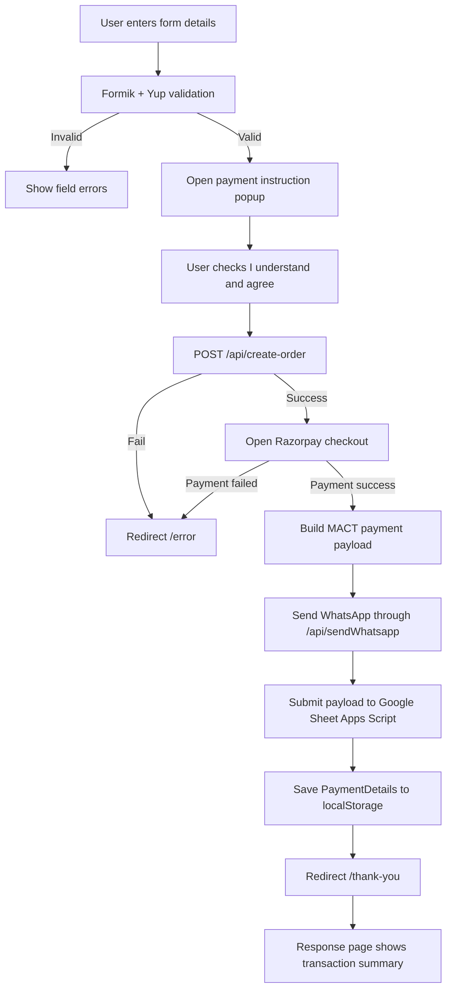

# MACT Payment Flow Implementation Plan

Document created on: 2026-07-06

## Goal

Create a complete registration, Razorpay payment, Google Sheet submission, WhatsApp message, and response-page flow for the MACT Masterclass Next.js project.

Use the supplied VLS Practice payment flow as the architecture reference, but adapt all labels, payload values, assets, and route behavior for this MACT Masterclass project.

## Current MACT Project State

The project currently has a simple form inside:

```text
src/component/banner/index.jsx
```

Current form behavior:

- Collects `name`, `email`, and `mobile`.
- Performs only simple inline validation for email and mobile.
- Pushes a GTM event.
- Shows a thank-you message.
- Does not create Razorpay orders.
- Does not open Razorpay checkout.
- Does not submit to Google Sheet.
- Does not send WhatsApp messages.
- Does not redirect to `/thank-you` or `/error`.
- Does not have response pages.

Current assets already available for response pages:

```text
public/assets/images/success.png
public/assets/images/error.png
public/assets/images/back.png
```

Use these React paths:

```text
/assets/images/success.png
/assets/images/error.png
/assets/images/back.png
```

## Required Target Flow



## Packages To Install

Install form/payment-flow packages from the reference:

```bash
npm install formik yup
```

Optional packages only if backend database registration is also implemented:

```bash
npm install axios react-query notistack
```

For the first MACT payment implementation, use only `formik` and `yup` unless database registration is required.

The project already has:

```text
lucide-react
bootstrap
```

## Environment Variables

Add these values to `.env.example`:

```env
NEXT_PUBLIC_RAZORPAY_KEY_ID=rzp_test_xxxxxxxxxx
RAZORPAY_KEY_SECRET=your_server_only_secret
REACT_APP_ASKEVA_API_KEY=your_askeva_api_key
NEXT_PUBLIC_GOOGLE_SHEET_URL=https://script.google.com/macros/s/YOUR_SCRIPT_ID/exec
```

Important security note:

- Use `NEXT_PUBLIC_RAZORPAY_KEY_ID` on the client.
- Use `RAZORPAY_KEY_SECRET` only inside `src/pages/api/create-order.js`.
- Do not expose the Razorpay secret with a `NEXT_PUBLIC_` prefix.

## MACT Course Constants

Update `src/constants/Home/index.js` to include payment and program metadata.

Recommended constant:

```js
export const mactPayment = {
  title: 'Motor Accident Claims Practice — 3 Hours Masterclass',
  amount: 499,
  currency: 'INR',
  programmDate: '2026-07-20',
  pageName: 'mact-masterclass',
  whatsappProgramName: '3-hour Motor Accident Claims Practice masterclass',
  whatsappSchedule: 'Sunday, July 20, 2026 10:30 AM - 01:30 PM IST',
  whatsappPlatform: 'Google Meet',
  whatsappLinkDate: 'Saturday, 19 July',
};
```

Use existing visible page values from `courseDetails` wherever possible:

```js
courseDetails.date = 'Sunday, July 20, 2026'
courseDetails.time = '10:30 AM – 01:30 PM IST'
courseDetails.offerPrice = '₹499'
```

## File Structure To Add

Create these files:

```text
src/component/contactform/index.jsx
src/component/contactform/styles.module.css
src/pages/api/create-order.js
src/pages/api/sendWhatsapp.js
src/pages/[response].jsx
src/pageComponents/Home/Response/index.jsx
src/component/Response/index.jsx
src/component/Response/styles.module.css
src/utils/paymentStorage.js
```

Update these existing files:

```text
src/component/banner/index.jsx
src/constants/Home/index.js
src/pages/_document.jsx
src/utils/useUTMSource/index.jsx
.env.example
```

## Banner Integration Plan

Replace the inline form logic in `src/component/banner/index.jsx` with the new `ContactForm` component.

Current inline form should be removed from `Banner`:

```jsx
const [formValues, setFormValues] = useState(initialForm);
const [message, setMessage] = useState('');
```

New banner form area:

```jsx
import ContactForm from '@/component/contactform';

<div className="form-card reveal from-right" id="register" style={{ transitionDelay: '.18s' }}>
  <ContactForm ipAddress={ipAddress} />
</div>
```

If IP tracking is implemented from the home page, pass `ipAddress`. If not implemented immediately, pass an empty string:

```jsx
<ContactForm ipAddress="" />
```

## Home Page IP Tracking Plan

Update `src/pageComponents/Home/index.jsx` if IP tracking is required.

Add:

```jsx
import { useEffect, useState } from 'react';
```

Behavior:

- Clear old `PaymentDetails` on home page load.
- Fetch IP from `https://api.ipify.org?format=json`.
- Pass IP address to `Banner`.

Recommended code:

```jsx
const [ipAddress, setIpAddress] = useState('');

useEffect(() => {
  localStorage.removeItem('PaymentDetails');

  fetch('https://api.ipify.org?format=json')
    .then((response) => response.json())
    .then((data) => setIpAddress(data.ip || ''))
    .catch(() => setIpAddress(''));
}, []);
```

Then render:

```jsx
<Banner ipAddress={ipAddress} />
```

## Contact Form Plan

Create `src/component/contactform/index.jsx`.

Responsibilities:

- Render the form UI inside the existing dark hero form card.
- Validate fields using Formik and Yup.
- Open payment instruction popup after validation.
- Require checkbox confirmation before payment.
- Create Razorpay order through `/api/create-order`.
- Open Razorpay checkout.
- Handle success and failure.
- Send WhatsApp message.
- Submit payload to Google Sheet.
- Store `PaymentDetails`.
- Redirect to `/thank-you` or `/error`.

Form fields:

| Field | Required | Validation |
| --- | --- | --- |
| `name` | Optional or required based on business decision | Letters and spaces only |
| `email` | Yes | Valid email and lowercase |
| `mobile` | Yes | Exactly 10 digits |

Recommended validation:

```js
Yup.object({
  name: Yup.string().matches(/^[a-zA-Z ]*$/, 'Invalid name'),
  email: Yup.string()
    .required('Email required')
    .email('Enter valid email')
    .test('lowercase', 'Email must be lowercase', (value) => !value || value === value.toLowerCase()),
  mobile: Yup.string()
    .required('Mobile required')
    .matches(/^[0-9]{10}$/, 'Invalid mobile number'),
});
```

## Contact Form UI Plan

Keep the same visual language as the current hero form:

- Title: `Register Now`
- Subtitle: `( Get Your MACT Practice — Roadmap )`
- Fields: Full Name, Email, Mobile
- Submit button: `SUBMIT`
- Pricing line: `INR ₹999 → ₹499`
- Limited-seat note

Add field-level validation errors below each input.

For mobile, use a `+91` country prefix UI like the reference.

## Payment Instruction Popup Plan

Reuse existing `src/common/Popup/index.jsx` if possible.

Instruction content:

```text
Payment Instructions

Please wait until you are redirected to the success page after completing payment.
Do not close, refresh, or go back during payment.
If the page is closed early, your registration details may not be recorded correctly.
```

Add checkbox:

```text
I understand and agree.
```

Button:

```text
I Agree & Pay ₹499
```

The button remains disabled until the checkbox is checked.

## Razorpay Script Plan

Update `src/pages/_document.jsx` to load Razorpay checkout globally:

```jsx
<script src="https://checkout.razorpay.com/v1/checkout.js" />
```

Place it inside `<Head />` or before `</body>` through `_document`. Keep GTM noscript behavior unchanged.

Recommended:

```jsx
<Head>
  <script src="https://checkout.razorpay.com/v1/checkout.js" />
</Head>
```

## Create Order API Plan

Create:

```text
src/pages/api/create-order.js
```

Endpoint:

```text
POST /api/create-order
```

Request body:

```json
{
  "amount": 499
}
```

Implementation behavior:

- Reject non-POST methods.
- Validate `amount` is numeric.
- Read:
  - `NEXT_PUBLIC_RAZORPAY_KEY_ID`
  - `RAZORPAY_KEY_SECRET`
- Convert rupees to paise.
- Send order request to Razorpay.
- Return Razorpay response or error.

Recommended server code shape:

```js
export default async function handler(req, res) {
  if (req.method !== 'POST') {
    return res.status(405).json({ error: 'Method not allowed' });
  }

  const { amount } = req.body || {};

  if (!amount || Number.isNaN(Number(amount))) {
    return res.status(400).json({ error: 'Valid amount is required' });
  }

  const keyId = process.env.NEXT_PUBLIC_RAZORPAY_KEY_ID;
  const secret = process.env.RAZORPAY_KEY_SECRET;

  if (!keyId || !secret) {
    return res.status(500).json({ error: 'Razorpay credentials missing' });
  }

  const auth = `Basic ${Buffer.from(`${keyId}:${secret}`).toString('base64')}`;
  const payload = {
    amount: Math.round(Number(amount) * 100),
    currency: 'INR',
    receipt: `mact_${Date.now()}`,
    payment_capture: 1,
  };

  const razorpayResponse = await fetch('https://api.razorpay.com/v1/orders', {
    method: 'POST',
    headers: {
      Authorization: auth,
      'Content-Type': 'application/json',
    },
    body: JSON.stringify(payload),
  });

  const data = await razorpayResponse.json();

  return res.status(razorpayResponse.status).json(data);
}
```

## Razorpay Checkout Plan

After `/api/create-order` succeeds, open checkout:

```js
const options = {
  key: process.env.NEXT_PUBLIC_RAZORPAY_KEY_ID,
  amount: order.amount,
  currency: order.currency,
  name: formValues.name || 'VLS Law Academy',
  order_id: order.id,
  description: `${mactPayment.title} - Rs.${mactPayment.amount}`,
  prefill: {
    name: formValues.name,
    email: formValues.email,
    contact: formValues.mobile,
  },
  theme: { color: '#b20a0a' },
  handler: async (response) => {
    // success flow
  },
};
```

Payment failure:

```js
razor.on('payment.failed', () => {
  router.replace('/error');
});
```

If `window.Razorpay` is missing, redirect to `/error` or show a user-facing error.

## Final MACT Payload Plan

After payment success, build payload:

```js
const apiPayload = {
  name: formValues.name || '',
  email: formValues.email,
  mobile: `+91${formValues.mobile}`,
  amount: order.amount / 100,
  programm_date: mactPayment.programmDate,
  razorpay_order_id: response.razorpay_order_id || '',
  razorpay_payment_id: response.razorpay_payment_id || '',
  razorpay_signature: response.razorpay_signature || '',
  payment_status: 'paid',
  captured: response.captured || '',
  page_name: mactPayment.pageName,
  ip_address: ipAddress,
  utm_source: getUTM('utm_source'),
  utm_medium: getUTM('utm_medium'),
  utm_campaign: getUTM('utm_campaign'),
  utm_term: getUTM('utm_term'),
  utm_content: getUTM('utm_content'),
};
```

## UTM Tracking Plan

Current file exists:

```text
src/utils/useUTMSource/index.jsx
```

Update it to store individual keys, matching the reference:

```text
utm_source
utm_medium
utm_campaign
utm_term
utm_content
```

If no UTM parameters exist:

- If referrer exists, use it as `utm_source`.
- If direct/local, store:
  - `utm_source = direct`
  - `utm_medium = none`
  - `utm_campaign = none`
  - `utm_term = none`
  - `utm_content = none`

The form should read UTM values with:

```js
const getUTM = (key) => {
  if (typeof window === 'undefined') return '';
  try {
    return localStorage.getItem(key) || '';
  } catch {
    return '';
  }
};
```

## WhatsApp API Plan

Create:

```text
src/pages/api/sendWhatsapp.js
```

Endpoint:

```text
POST /api/sendWhatsapp
```

Required body fields:

- `phone`
- `name`
- `amount`
- `programm_name`
- `schedule`
- `platform`
- `link_date`

Use AskEva endpoint:

```text
https://backend.askeva.io/v1/message/send-message
```

Environment variable:

```text
REACT_APP_ASKEVA_API_KEY
```

Template name:

```text
event_remainder
```

After payment success, call:

```js
await handleWhatsappMessage(
  `91${formValues.mobile}`,
  formValues.name,
  mactPayment.amount,
  mactPayment.whatsappProgramName,
  mactPayment.whatsappSchedule,
  mactPayment.whatsappPlatform,
  mactPayment.whatsappLinkDate
);
```

## Google Sheet Submission Plan

Use Google Apps Script URL from env:

```text
NEXT_PUBLIC_GOOGLE_SHEET_URL
```

Submit as URL encoded form data:

```js
const params = new URLSearchParams();
Object.keys(apiPayload).forEach((key) => {
  params.append(key, apiPayload[key] ?? '');
});
```

Function behavior:

- POST `application/x-www-form-urlencoded`.
- Retry up to 3 times.
- Wait 1500ms between retries.
- Return `true` on OK response.
- Return `false` after final failure.
- Do not block success redirect if Google Sheet fails, unless business wants strict recording.

## Payment Details Storage Plan

Create:

```text
src/utils/paymentStorage.js
```

Exports:

```js
export const safeSetPaymentDetails = (data) => { ... };
export const safeGetPaymentDetails = () => { ... };
export const clearPaymentDetails = () => { ... };
```

Use localStorage key:

```text
PaymentDetails
```

Store payload before redirecting to `/thank-you`.

## Response Routes Plan

Create dynamic Pages Router route:

```text
src/pages/[response].jsx
```

Implementation:

```jsx
import ResponsePageComponent from '@/pageComponents/Home/Response';

export default function ResponsePage() {
  return <ResponsePageComponent />;
}
```

Create page wrapper:

```text
src/pageComponents/Home/Response/index.jsx
```

Implementation:

```jsx
import Response from '@/component/Response';

export default function ResponsePageComponent() {
  return <Response />;
}
```

## Response UI Plan

Create:

```text
src/component/Response/index.jsx
src/component/Response/styles.module.css
```

Use route query:

```js
const { query } = useRouter();
const isSuccess = query.response === 'thank-you';
```

Assets:

| State | Image |
| --- | --- |
| Success | `/assets/images/success.png` |
| Error | `/assets/images/error.png` |
| Back button icon | `/assets/images/back.png` |

Success page should show:

- Success icon.
- Heading: `Payment Successful`.
- Message: `Your MACT Masterclass registration is confirmed.`
- Transaction summary if `PaymentDetails` exists.
- `Back to Home` button.

Error page should show:

- Error icon.
- Heading: `Payment Failed`.
- Message: `Your payment could not be completed. Please try again or contact support.`
- `Back to Home` button with `back.png`.
- `Call Support` button linking to `tel:+919500207811`.

Transaction summary fields:

| Label | Payload Field |
| --- | --- |
| Name | `name` |
| Email | `email` |
| Mobile | `mobile` |
| Amount | `amount` |
| Transaction ID | `razorpay_payment_id` |

## Response Styling Plan

Use MACT design tokens:

- `var(--ff-head)` for headings.
- `var(--red)` for error and CTA accents.
- Green for success.
- White card surface.
- 8px radius.
- Responsive mobile spacing.

Suggested CSS module classes:

```text
responseSection
responseCard
statusImage
successText
errorText
message
summaryBox
summaryRow
actionRow
backButton
supportButton
```

## Success Redirect Plan

After all post-payment side effects:

```js
safeSetPaymentDetails(apiPayload);
window.location.href = '/thank-you';
```

## Error Redirect Plan

Use:

```js
router.replace('/error');
```

Redirect to `/error` when:

- `/api/create-order` fails.
- `window.Razorpay` is unavailable.
- Razorpay payment fails.
- Razorpay success response lacks `razorpay_payment_id`.
- Unexpected payment handler error occurs.

## Form Processing Popup Plan

Use the shared `Popup` component while post-payment actions run.

Text:

```text
Processing your registration...
Please do not close this page.
```

Keep popup open until redirect.

## GTM Event Plan

Push useful events:

```js
window.dataLayer?.push({ event: 'mact_register_submit', course: mactPayment.title });
window.dataLayer?.push({ event: 'mact_payment_started', amount: mactPayment.amount });
window.dataLayer?.push({ event: 'mact_payment_success', payment_id: response.razorpay_payment_id });
window.dataLayer?.push({ event: 'mact_payment_failed' });
```

## Implementation Steps

1. Install `formik` and `yup`.
2. Add payment constants to `src/constants/Home/index.js`.
3. Update `.env.example` with Razorpay, AskEva, and Google Sheet variables.
4. Load Razorpay checkout script in `src/pages/_document.jsx`.
5. Create `src/pages/api/create-order.js`.
6. Create `src/pages/api/sendWhatsapp.js`.
7. Create `src/utils/paymentStorage.js`.
8. Update `src/utils/useUTMSource/index.jsx` to store individual UTM keys.
9. Create `src/component/contactform/index.jsx`.
10. Create `src/component/contactform/styles.module.css`.
11. Replace the inline `Banner` form with `ContactForm`.
12. Add optional IP tracking in `src/pageComponents/Home/index.jsx` and pass `ipAddress` to `Banner`.
13. Create `src/pages/[response].jsx`.
14. Create `src/pageComponents/Home/Response/index.jsx`.
15. Create `src/component/Response/index.jsx`.
16. Create `src/component/Response/styles.module.css`.
17. Test validation errors.
18. Test instruction popup checkbox behavior.
19. Test `/api/create-order` with missing env and valid env.
20. Test payment success redirect to `/thank-you`.
21. Test payment failure redirect to `/error`.
22. Test response page summary from `PaymentDetails`.
23. Run `npm run build`.

## Acceptance Checklist

- [ ] Form validates `name`, `email`, and `mobile` with Formik/Yup.
- [ ] Email must be lowercase.
- [ ] Mobile must be exactly 10 digits.
- [ ] Valid form opens instruction popup.
- [ ] Pay button is disabled until agreement checkbox is checked.
- [ ] Razorpay checkout script loads globally.
- [ ] `/api/create-order` creates Razorpay orders server-side.
- [ ] Razorpay secret is not exposed as a public variable.
- [ ] Successful payment builds MACT-specific payload.
- [ ] WhatsApp API route sends the template request.
- [ ] Google Sheet receives URL encoded payload.
- [ ] Payment details are saved to `localStorage.PaymentDetails`.
- [ ] Success redirects to `/thank-you`.
- [ ] Failure redirects to `/error`.
- [ ] `/thank-you` shows `success.png` and transaction summary.
- [ ] `/error` shows `error.png`, back CTA, and support CTA.
- [ ] Back CTA uses `back.png`.
- [ ] Home page clears old `PaymentDetails` on load.
- [ ] `npm run build` passes.

## Notes

- This plan intentionally uses the existing image paths in this MACT project: `/assets/images/success.png`, `/assets/images/error.png`, and `/assets/images/back.png`.
- The current `Button` component accepts children and CSS classes. Response page CTAs can either use the existing `Button` component or local buttons styled in `Response/styles.module.css`.
- The current shared `Popup` component is simple and can be reused for instruction and processing popups.
- Razorpay test mode should be verified before using live credentials.
- Signature verification is not included in the reference flow, but a production-grade payment flow should verify `razorpay_signature` server-side before final confirmation.